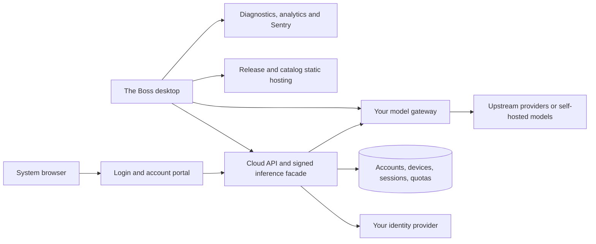

# Replacing Cherry services in The Boss with your own domains

## Scope and main finding

This guide audits The Boss checkout at commit `8344b485203427952716cd142da28c181162be61`, inspected on September 25, 2026. It describes the desktop client's expectations and a proposed replacement architecture. It does **not** claim that replacement servers have been implemented, deployed, or tested against live accounts. Other branches and integration worktrees may differ.

There is no single “Cherry CN server.” The fork retains several independent services: Cherry Cloud accounts and subscriptions, CherryIN OAuth and model access, a free/default model endpoint, automatic updates, provider metadata, diagnostics, analytics, and Sentry. Some are CN-specific; several are shared with the global edition.

Changing the product website or DNS alone will not migrate them. [Branding constants](../../src/shared/utils/branding.ts) deliberately exclude Cherry-operated services. Client routes, signatures, account schemas, trust allowlists, and persisted settings must agree with the replacement servers.

Two practical levels of independence are available:

- **Own inference and infrastructure:** configure your own model provider, move updates/catalog/diagnostics, and replace or disable account features you do not need. This is the smaller project.
- **Complete Cherry-compatible account experience:** additionally implement the Cloud authorization, device sessions, entitlements, quota accounting, account portal, and model facade described below. Preserve CherryIN OAuth separately only if you want its provider-specific login, balance, and top-up experience.

You can consolidate the two account experiences in a future product design, but that requires client changes. This checkout does not treat them as interchangeable.

## Service inventory

| Current destination | Purpose and trigger | Replacement required |
| --- | --- | --- |
| `cloud.cherryai.com.cn` / `cloud.cherryai.com` | CN/global Cherry Cloud login, account, subscription models, refresh and inference | Custom compatible account/control API, browser portal, signed inference facade |
| `open.cherryin.ai` / allowed development host `open.cherryin.dev` | CherryIN browser OAuth, API-key retrieval, balance/profile/revocation | OAuth service plus CherryIN-specific account APIs; or replace this UI with your own provider configuration |
| `open.cherryin.net` and selectable `.ai` host | CherryIN model inference | Compatible model gateway, upstream credentials, protocol-specific routes |
| `api.cherry-ai.com/chat/completions` | Managed free/default CherryAI model | Signed OpenAI-style chat endpoint, or migrate defaults to another provider |
| `releases.cherry-ai.com` | Automatic update feed and separately fetched release history | Metadata, installers, checksums, release-note JSON and a publishing process |
| CherryHQ raw GitHub/GitCode URLs | Background model-catalog refresh | Compatible static catalog snapshots on your domain |
| `api.cherry-ai.com/diagnostics` | User-submitted diagnostic ZIPs | Multipart receiver, signature validation, protected archive storage and report IDs |
| `analytics.cherry-ai.com` | Consent-gated launch and usage analytics, through an SDK default | Compatible receiver or deliberate removal/disablement |
| `o4509184559218688.ingest.us.sentry.io` | Consent-gated production error reporting | Your own Sentry project/DSN or compatible self-hosted Sentry |
| Cherry documentation, download, console and mobile links | Browser navigation following user actions | Your corresponding pages; a mobile download page is not a mobile backend |

Edition selection comes from `CHERRY_EDITION` in development and packaged `package.json.cherryEdition`; a missing packaged value means global. CN builds also alter application identity. Switching to global does **not** remove Cherry dependencies. See [edition resolution](../../src/main/utils/appEdition.ts) and [build scripts](../../package.json).

## Suggested domain and hosting layout

The following names are examples, not existing settings or provisioned services. Substitute domains you control.

| Example domain | Hosted responsibility |
| --- | --- |
| `cloud.example.com` | Cloud-compatible API, login/consent/account portal, signed inference facade |
| `models.example.com` | Model gateway; optional CherryIN-compatible OAuth/account adapter |
| `releases.example.com` | Desktop update metadata, installers, blockmaps and release history |
| `registry.example.com` | Versioned provider-model catalog snapshots |
| `diagnostics.example.com` | Diagnostic upload API; archives stored privately |
| `analytics.example.com` | Opt-in event ingestion |
| `errors.example.com` | Sentry ingestion, if self-hosting |
| `apps.example.com`, `docs.example.com`, `www.example.com` | Optional mini-app packages, documentation, downloads and product pages |

Several hostnames can route to one deployment. Static catalogs and releases can use object storage/CDN; account/session/quota services need a database and server-side logic. Do not put diagnostic archives in a public release bucket.



A standard gateway can be reused behind the facade. For example, [New API's primary repository](https://github.com/QuantumNous/new-api) documents multiple model protocols, but its [authentication API](https://github.com/QuantumNous/new-api/blob/main/docs/authentication.md) differs from the contracts here. It is not a verified drop-in Cloud or CherryIN account server.

Your existing liter-llm gateway may serve the inference role for protocols you verify it supports. UAR and surreal-memory-server have separate runtime/memory responsibilities; neither should be assumed to implement these account APIs. Compass is development tooling, not a production replacement service.

## 1. Cherry Cloud: account, subscriptions and signed inference

### Origin and configuration

[CherryCloudService](../../src/main/services/cherryCloud/CherryCloudService.ts) defaults to `https://cloud.cherryai.com.cn` for CN and `https://cloud.cherryai.com` for global. The existing build-time override is:

```dotenv
MAIN_VITE_CHERRY_CLOUD_API_ORIGIN=https://cloud.example.com
MAIN_VITE_CHERRY_CLOUD_CLIENT_SECRET=<your-build-and-server-shared-value>
```

These are main-process build inputs, not an existing end-user runtime settings screen. Exporting them when starting an already packaged app does not rebuild it. The origin parser uses `new URL(value).origin`, so a value such as `https://example.com/boss-cloud` loses its path prefix. Use a dedicated origin or change the client deliberately.

A missing Cloud client secret prevents login before the authorization request. The service needs its own secret even if a model gateway works normally.

### Required API and browser flow

| Method and path | Request / response expected by this client |
| --- | --- |
| `POST /api/v1/desktop/authorizations` | HMAC-authenticated JSON containing `state`, `code_challenge`, `code_challenge_method: "S256"`, `device_public_key`, `machine_code`, `platform`, `client_version`, `callback_port`. Returns UUID `authorization_id`, `authorization_url`, UTC `expires_at`. |
| Browser authorization URL | Authenticate the person, obtain consent and associate the desktop device. URL must be HTTPS or loopback HTTP, without embedded credentials. |
| `POST /api/v1/desktop/authorizations/{id}/exchange` | HMAC-authenticated `{state,handoff_code,code_verifier}`. Returns `{token_set,account}`. |
| `GET /api/v1/account` | Bearer token and device signature; returns the account snapshot below. |
| `POST /api/v1/product-sessions/refresh` | Device-signed `{session_id,refresh_token}` without an access-token Bearer header. Returns `{token_set}`. |
| `DELETE /api/v1/product-sessions/current` | Bearer and device signature; revoke the current session. Local sign-out occurs first; remote revocation is best-effort. |
| `GET /v1/models?limit=1000` | Bearer and device signature; client also sends `anthropic-version: 2023-06-01`. Returns the enriched model list below. |
| `POST /v1/messages` | Anthropic Messages-compatible inference with Bearer/device signature and an idempotency key. |
| `POST /v1/chat/completions` | OpenAI Chat Completions-compatible inference with Bearer/device signature and an idempotency key. |
| `GET /login/complete` | Browser completion page; desktop app redirects here with a `desktop_result` fragment after callback handling. |

The Cloud callback is **local to the user's computer**:

```text
http://127.0.0.1:<ephemeral-port>/cloud-auth/callback
  ?authorization_id=<uuid>&state=<state>&handoff_code=<one-time-code>
```

The app binds loopback port `0` and tells the server the actual allocated port. The browser flow returns there; do not replace this callback with a public DNS name. The desktop validates pending authorization ID, state and expiry, exchanges the code, then returns a 303 redirect to `<cloud-origin>/login/complete#desktop_result=success` or `failure`/`invalid`. The URL fragment is available to page JavaScript, not sent as an HTTP query. See [loopback handling](../../src/main/services/cherryCloud/CherryCloudLoopbackCallback.ts).

### Response contracts

The [runtime schemas](../../src/main/services/cherryCloud/contracts.ts) are authoritative. A conventional identity-provider JWT cannot simply substitute for these tokens: access and refresh tokens must each encode **32 bytes as unpadded base64url**, with the strict 43-character schema.

```text
token_set = {
  token_type: "Bearer",
  access_token: <32-byte base64url token>,
  expires_in: <positive integer seconds>,
  refresh_token: <32-byte base64url token>,
  session_id: <UUID>,
  session_expires_at: <UTC ISO datetime>
}

account snapshot = {
  account: { id: <UUID>, display_name?: <nonempty string> },
  session: { id: <UUID>, expires_at: <UTC ISO datetime> },
  device: { id: <UUID> },
  entitlements: [{
    plan_id: <UUID>, plan_name: <nonempty string>, is_free: <boolean>,
    status: "inactive" | "active" | "expired", model_ids: [<model ID>]
  }],
  quota_pools: [{
    model_ids: [<model ID>],
    windows: [{ remaining_units: <nonnegative integer> }, ...]
  }]
}

model list = { data: [{
  id: <valid model ID>, display_name: <nonempty string>,
  endpoint_type: "anthropic-messages" | "openai-chat-completions",
  context_window: <positive integer>, max_output_tokens: <positive integer>,
  capabilities?: [<recognized capability>]
}] }
```

Each quota pool needs at least one window. Model IDs must pass the provider registry's ID rules. Only recognized capability strings are retained. Entitlements and quota pools default to empty arrays, which is not equivalent to granting access.

The client intersects active entitlement model IDs with the catalog. For a matching quota pool, availability requires every window to have capacity; an available matching pool can satisfy availability. No matching pool is treated as unknown rather than exhausted: an empty `quota_pools` array alone does not block an actively entitled model in the UI. An ordinary OpenAI `/v1/models` response without these fields and account grants will not reproduce the experience. Server-side authorization and usage accounting remain necessary regardless of UI state.

### Both authentication schemes must be implemented

**Authorization creation/exchange: HMAC-SHA256.** [SignatureClient](../../src/main/ai/provider/cherryai.ts) signs this newline-joined sequence, without adding a terminal newline:

```text
<METHOD>
<PATH>
<QUERY>
<CLIENT_ID>
<UNIX_SECONDS>
<EXACT_BODY_STRING>
```

Headers are `X-Client-ID`, `X-Timestamp`, `X-Signature`; the signature is hexadecimal. Cloud uses client ID `cherry-studio` and the explicit `MAIN_VITE_CHERRY_CLOUD_CLIENT_SECRET`. It does not use the extra suffix applied to the free-model secret.

**Authenticated requests: Ed25519 device signatures.** The device supplies its raw 32-byte public key as base64url at authorization. [The signing implementation](../../src/main/services/cherryCloud/crypto.ts) constructs:

```text
cherry-device-signature-v2
<METHOD uppercase>
<pathname plus query>
<UNIX_SECONDS>
<REQUEST_UUID>
<SHA256 exact body bytes, hex>
<IDEMPOTENCY_KEY or empty>
<MACHINE_CODE>
```

Headers are `Cherry-Device-ID`, `Cherry-Request-ID`, `Cherry-Timestamp`, `Cherry-Body-SHA256`, `Cherry-Signature-Version: 2`, `Cherry-Machine-Code`, and base64url `Cherry-Signature`. The service adds `Authorization: Bearer ...` except for refresh. Inference carries `Idempotency-Key`.

A compatible server must verify the signature against the registered device and session. Timestamp/replay policy, one-time handoffs, refresh rotation, revocation, idempotency retention and quota accounting are server responsibilities to design; the client code does not reveal Cherry's complete server implementation or exact acceptance windows. An embedded desktop HMAC secret can be extracted and must not serve as proof of paid entitlement.

At the proxy, preserve exact signed body bytes and the request target. Avoid redirects and path rewriting before signature verification. Support streaming responses without proxy buffering, cancellation and appropriate stream timeouts. The client restricts inference to its configured origin and supported paths and rejects redirects.

### Minimum backend components

To retain this experience, provide an account/identity integration, browser login/consent portal, pending authorization and handoff store, device-key registry, session/token lifecycle, entitlement/catalog service, quota ledger and inference adapter. Billing/payment processing is only needed if you choose paid plans; the desktop's plan fields do not force a particular payment provider.

The client refreshes near token expiry and caches models briefly. Its credential store persists the refresh token and device private key in a mode-0600 JSON file; this class does not encrypt them or store an account origin. Access tokens are not persisted. Before changing the Cloud origin, sign out and sign in to the new service, or implement a deliberate origin-scoped credential migration. Do not erase unrelated application data. See [credential storage](../../src/main/services/cherryCloud/CherryAccountCredentialStore.ts).

## 2. CherryIN: model gateway plus a separate OAuth account experience

### Model traffic

The [provider preset](../../packages/provider-registry/src/providers/cherryin.ts) and [SDK implementation](../../packages/ai-sdk-provider/src/cherryin-provider.ts) support multiple protocols. Actual SDK defaults use `https://open.cherryin.net/v1` for OpenAI and Anthropic and `https://open.cherryin.net/v1beta/models` for Gemini. Some comments/documentation describe older prefixes; use executable code and actual outgoing requests as authority.

Your gateway may need `/v1/chat/completions`, `/v1/responses`, `/v1/messages`, `/v1/models`, and Gemini `.../v1beta/models/{model}:generateContent` / `:streamGenerateContent`. Additional image, embedding, audio or rerank routes are needed only for capabilities you expose. Match the applicable Bearer/vendor API-key headers, streaming formats, tool calls, usage and error envelopes. [Boss provider configuration](../../src/main/ai/provider/config.ts) derives endpoint-specific bases; avoid adding `/v1` twice.

For basic use, configure your gateway as an appropriate API-key provider. That avoids implementing CherryIN's proprietary account APIs. The [official CherryIN onboarding guide](https://docs.cherryin.ai/en/docs/newapi/getting-started/) describes account creation, credits and API keys; those commercial account services are separate from inference routing.

### Preserving the CherryIN login UI

The [OAuth configuration](../../src/main/services/oauth/CherryInOAuthConfig.ts) permits only `https://open.cherryin.ai` and `https://open.cherryin.dev`. The renderer also has its own fixed OAuth server and top-up URLs. Changing the inference hostname does not update login, balance or browser links. Also replace or remove `API_HOST_OPTIONS` in `CherryInSettings.tsx`: it currently offers only `open.cherryin.net` and `open.cherryin.ai`, displays an unrecognized custom host as the first option, and writes Cherry domains back into endpoint configuration when selected. Migrating the stored endpoint alone does not fix that selector.

Register your own native public OAuth client and change the client ID, allowlist and renderer URLs together. The current callback is fixed at `http://127.0.0.1:29873/oauth/callback`; preserve it when compatible, or change both registration and client configuration. The scopes requested are `openid profile email offline_access balance:read usage:read tokens:read tokens:write`.

| Method and path | Expected behavior |
| --- | --- |
| `GET /oauth2/auth` | Authorization-code browser flow, state and PKCE S256 |
| `POST /oauth2/token` | Form-encoded code exchange (`grant_type`, `client_id`, `code`, `code_verifier`, `redirect_uri`) or refresh (`grant_type`, `client_id`, `refresh_token`); response includes `access_token` and supported optional token/expiry fields |
| `GET /api/v1/oauth/tokens` | Bearer authentication; array of strings, `{key}` objects or `{token}` objects, optionally inside `{data: [...]}`. Nonempty keys populate the provider credentials; no usable keys fails login. |
| `GET /api/v1/oauth/balance` | `{success:true,data:{quota:number,used_quota:number}}`; the service divides `quota` by `500000` and the UI displays the result as dollars. `used_quota` is required and logged but is not used in that displayed balance; coordinate units and labels |
| `GET /api/user/self` | Profile directly or under `data`; optional nullable `display_name`, `username`, `email`, `group` |
| `POST /oauth2/revoke` | Form-encoded `token` and `token_type_hint=access_token`; local credentials are cleared afterward |
| Browser console pages | Replace `/console/topup`, `/console/token`, `/pricing` and documentation links as appropriate |

Implementation references: [provider OAuth runtime](../../src/main/services/oauth/runtime/providers/cherryin.ts), [PKCE client](../../src/main/services/oauth/runtime/PkceOAuthClient.ts), [account service](../../src/main/services/oauth/CherryInOAuthService.ts), [login UI](../../src/renderer/pages/settings/ProviderSettings/ProviderSpecific/CherryInOauth.tsx) and [provider settings](../../src/renderer/pages/settings/ProviderSettings/ProviderSpecific/CherryInSettings.tsx).

## 3. Free/default CherryAI model

The managed `cherryai` provider uses `https://api.cherry-ai.com`; it is distinct from `cherryai-subscription` Cloud. The provider builder deliberately does not append `/v1`: its request is **`POST /chat/completions`**.

To retain this tier, change the [preset](../../src/shared/data/presets/cherryai.ts), host an OpenAI-style chat service at that path, and implement the HMAC contract above. Its effective key combines `MAIN_VITE_CHERRYAI_CLIENT_SECRET` with a static source-defined suffix; use your own value and match both client/server derivation. The suffix is public code, not additional security. Changing the signed path requires changing its signing configuration too.

Alternatively, seed your own provider/model and migrate defaults to it. [The default model seeder](../../src/main/data/db/seeding/seeders/cherryaiDefaultModelSeeder.ts) creates or repairs the managed provider and fills missing chat, quick-assistant and translation defaults. Hiding a provider row or changing only a preset may leave existing installations unchanged or allow the managed provider to reappear. Plan an explicit migration for persisted endpoint configuration and default model IDs.

## 4. Updates and release distribution

Change **both** [global builder configuration](../../electron-builder.yml) and [CN builder configuration](../../electron-builder.cn.config.cjs). Packaged clients read the generated `app-update.yml`; development uses [dev-app-update.yml](../../dev-app-update.yml), currently localhost. No end-user feed URL override was found.

Host the channel metadata generated by your release tooling together with the exact referenced installers, integrity hashes and any referenced blockmaps. Preserve platform/architecture separation and code signing. Channel selection covers `latest`, `rc`, `beta` and CN-suffixed variants; platform-specific filenames are handled by the updater. Use the actual generated artifacts rather than inventing metadata or serving one installer under all channels.

[AppUpdaterService](../../src/main/services/AppUpdaterService.ts) sends `Client-Id`, `App-Name`, `App-Version`, `OS`, `X-Edition`, `X-Region`, `User-Agent` and no-cache headers. A static feed can work without Cherry's regional rollout policy, but it must serve an appropriate release for each supported channel. Packaged nonportable clients check shortly after startup and periodically afterward.

Separately replace its `RELEASE_HISTORY_URL` pointing to `/release-history.json`. The response is a nonempty array of exact `{version,releaseNotes}` objects with unique stable semver versions. Notes require the language markers `<!--LANG:en-->`, `<!--LANG:zh-CN-->`, and `<!--LANG:END-->`. A bundled fallback exists. The fetch has a 10-second timeout and 1-MiB ceiling. See [release-note parser](../../src/shared/utils/releaseNotes.ts) and [existing update guide](app-upgrade.md).

The [Boss release workflow](../../.github/workflows/the-boss-release.yml) and [installer publisher](../../scripts/publish-installers.cjs) already publish Boss GitHub download links, but that does **not** repoint the automatic updater. Your publishing job must publish the new feed as well. Existing installed binaries will retain their old feed until replaced through a distribution path you control; a domain you do not own cannot be redirected by your DNS.

## 5. Provider-model catalog distribution

[ProviderRegistryUpdaterService](../../src/main/services/ProviderRegistryUpdaterService.ts) uses these roots:

```text
Global: https://raw.githubusercontent.com/CherryHQ/cherry-studio/refs/heads/x-files/provider-registry/v2
CN:     https://raw.gitcode.com/CherryHQ/cherry-studio/raw/x-files%2Fprovider-registry/v2
```

Repoint both roots to your static hosting. It fetches `manifest.json`, `models.json` and `provider-models.json`, beginning after 30 seconds in packaged apps and repeating every six hours.

The manifest requires `minAppVersion`, `sourceAppVersion`, nonnegative `revision`, `schemaVersion: 2`, and a `files` map of filename to content-hash version. The app version must be inside the declared compatibility range. A downloaded revision must advance past the active snapshot, and each data file's `version` must match the manifest entry. Publish a complete compatible snapshot atomically; do not serve arbitrary model JSON under those names.

The [loader](../../packages/provider-registry/src/registry-loader.ts) explicitly treats the remote catalog as unsigned and limits it to model metadata. Provider definitions and credential-routing destinations remain bundled. Consequently, publishing a catalog cannot migrate CherryIN base URLs; edit the canonical [provider definition](../../packages/provider-registry/src/providers/cherryin.ts) and regenerate bundled data through its existing tooling. Do not rely on editing only generated `data/providers.json`.

## 6. Diagnostics, analytics and errors

### Diagnostic archive submission

The [upload client](../../src/main/services/diagnostics/CherryDiagnosticUploadClient.ts) posts multipart `description` and ZIP `file` to `/diagnostics`. It allows archives up to 100 MiB, responses up to 64 KiB and forbids redirects. A successful JSON response needs a nonempty string `id`; an ambiguous 2xx response becomes “submission unknown.”

Implement a private archive receiver with access-controlled retrieval and report IDs. Preserve these error mappings: `400` with `code: "invalid_diagnostic_archive"`, `401`/`409` authentication failure, `413` too large, `429` rate limited and `502` unavailable. Match proxy upload limits to the application limit.

The v2 HMAC canonical sequence is newline-joined `v2`, `POST`, `/diagnostics`, empty query, client ID, Unix timestamp, request UUID, file byte size, ZIP SHA256 and description SHA256. Headers: `X-Signature-Version: 2`, `X-Client-ID`, `X-Timestamp`, `X-Request-ID`, `X-File-Size`, `X-File-SHA256`, `X-Description-SHA256`, `X-Signature`. It uses the same effective secret derivation as the free-model provider. Verify the uploaded bytes and description, not the incidental multipart boundary. See [diagnostic signing](../../src/main/ai/provider/cherryai.ts).

This archive service is separate from Sentry. Provision storage lifecycle/retention and operator access deliberately because archives can contain user diagnostics.

### Analytics

[AnalyticsService](../../src/main/services/AnalyticsService.ts) constructs `@cherrystudio/analytics-client` without its supported `baseUrl` option. Targeted inspection of the installed SDK revealed the default `https://analytics.cherry-ai.com` and these routes:

| Route | JSON body | Successful response |
| --- | --- | --- |
| `POST /api/events` | `{client_id,channel,events:[{event_type,timestamp,data}]}` | `{success:true,count}` or HTTP 204 |
| `POST /api/track` | `{client_id}` | `{success:true}` or HTTP 204 |

Events include launch version/OS and provider/model/token-usage metadata. Set your own SDK base URL and channel in the application integration, implement an adapter for your analytics system, or intentionally disable this feature. A generic analytics product will not automatically accept these envelopes.

Collection requires data-collection consent under the current privacy policy; revocation aborts/discards pending work. Preserve this behavior when replacing the service. The SDK discovery came from the locally installed dependency, not the Compass source graph, and should be rechecked when updating that dependency.

### Sentry

[Main-process Sentry setup](../../src/main/services/sentry.ts) embeds an upstream project DSN. Replace it with your own hosted project or [self-hosted Sentry](https://github.com/getsentry/self-hosted); the renderer bridge is initialized separately but uses the Electron integration. Production and consent checks apply, and events are sanitized.

The `.env.example` `SENTRY_*` source-map upload settings do **not** replace the runtime DSN. Configure source-map upload ownership and runtime event routing separately. A reverse proxy to Cherry's project would still deliver data to Cherry; point to a project you operate.

## 7. Mini-apps, backups, search and remaining links

**Mini-app hosting:** no central Cherry marketplace fetch was found in the inspected install path. The built-in mini-app list is empty; website presets are bundled. You can host manifest/package files on `apps.example.com`, using the [manifest schema](../../src/shared/types/miniAppManifest.ts): update URLs, package URL/hash/size, permissions and network declarations. Downloads use HTTPS, omit cookies and prohibit redirects.

The namespace `com.cherrystudio.*` is reserved to the official origin `https://cherryai.com`. Use your own package namespace; changing that trust anchor is a deliberate security change, not ordinary branding. Installed web-app update origins are pinned, and added/dropped/moved origins are rejected. Plan reinstalls or an explicitly designed migration when moving existing packages. See [web installer](../../src/main/features/miniApp/install/webInstaller.ts).

**Backup/sync:** existing WebDAV and S3 backups use user-supplied hosts/endpoints. You can supply your own WebDAV server or compatible object store. Nutstore is a separate third party at `dav.jianguoyun.com`; choose a configurable backup type to replace it. A `/cherry-studio` folder is a storage path, not a network dependency. Backup/restore is not proof of continuous multi-device account synchronization. [The upstream sync issue](https://github.com/CherryHQ/cherry-studio/issues/14898) is a roadmap discussion, not a deployable compatible server specification.

**Web search:** the inspected provider layer uses independently configured services such as SearxNG, Tavily, Exa, Jina and Firecrawl. Use supported host/key overrides or self-host a supported search backend. These are not all routed through a Cherry server. See [search presets](../../src/shared/data/presets/webSearchProviders.ts).

**Region detection:** [RegionService](../../src/main/services/RegionService.ts) queries IPInfo `/lite/me` using an embedded token, caches the result and defaults to CN on failure. It affects catalog mirror selection and update-region headers. For complete operational ownership, replace that integration or choose an explicit region policy. Do not treat IPInfo as Cherry infrastructure.

**Links requiring a separate branding pass:** main menu documentation/issues/releases, renderer help, main-window and migration download pages, CherryIN console/pricing, device-connection mobile downloads and mini-app developer documentation. Inspect [AppMenuService](../../src/main/services/AppMenuService.ts), [MainWindowService](../../src/main/services/MainWindowService.ts), [migration handler](../../src/main/data/migration/v2/window/MigrationIpcHandler.ts) and the associated renderer pages. Hosting a replacement download page does not implement the device protocol or a mobile application.

**Strings that do not imply a connection to that hostname:** `new URL(relativePath, 'https://www.cherry-ai.com')` used to parse internal paths, `app://cherryai.com.cn` attribution, package names like `@cherrystudio/ui`, and database/folder names. The attribution value can still be transmitted to the selected provider as `X-App-URL`; it is not itself a server destination. Do not blindly replace these strings. The Electron `npmmirror` entry is a build-time download mirror. Separately, optional runtime binary/package installation paths also use npmmirror; those are third-party dependency mirrors to review if you want all downloads under your control.

[Network Doctor endpoints](../../src/main/services/network/endpoints.ts) derive update, catalog, cloud and diagnostic probes from their owning service constants. Include these probes in validation after migration. Some protocol identifiers still say Cherry Studio, including the user agent and analytics channel; change them only with the receiving service's expectations in mind.

## Implementation sequence

1. **Choose feature scope.** Decide whether you need full Cloud accounts, CherryIN login, both, or your own API-key provider experience. Record which optional telemetry and diagnostic features you will operate.
2. **Provision your origins.** Configure DNS, TLS and routing for the example responsibilities above. Use private storage for diagnostics and a durable database for account/session/quota state. Public release artifacts and catalogs can be static.
3. **Make inference work.** Configure upstream credentials or your own models. Verify each protocol you intend to advertise. Put the Cloud signature/account facade in front only where the client expects it.
4. **Implement account contracts if retained.** Use your identity provider behind the custom desktop authorization adapter. Implement schemas, device keys, token rotation, revocation, entitlement checks and quota charging. Implement CherryIN's separate OAuth/account routes if retaining that interface.
5. **Change the client integration points.** Set the two existing Cloud build inputs; update free-model presets/signing, CherryIN preset/allowlist/client ID/renderer URLs, both builder feed URLs, release history, catalog roots, diagnostics endpoint, analytics constructor and Sentry DSN. Other environment variables mentioned in a proposed design are not automatically supported; add explicit client wiring if you choose to introduce them.
6. **Migrate existing installs.** Preserve application identity and user-data paths unless intentionally migrating them. Move persisted providers/default model selections; handle account sign-out/re-enrollment; address pinned mini-app origins. Test populated data as well as fresh installs.
7. **Publish a complete release.** Build your selected CN/global editions with your endpoints, sign binaries, publish matching updater metadata and release history, and distribute an initial replacement to users whose old binaries still point to Cherry.
8. **Validate the finished integration.** Run the acceptance flows below against services you control. Compare actual network traces with your intended egress policy before declaring independence.

## Acceptance checklist for a replacement deployment

- Fresh and existing installations use the intended origins; provider/default-model migration preserves user data.
- Cloud login works through a real browser and ephemeral loopback callback; cancellation, expired handoff and invalid state do not create a session.
- Token refresh, restart restoration, device binding and logout/revocation work with server-side enforcement. Incorrect signatures, altered request bytes and replayed requests are rejected by the designed policy.
- Entitled models appear with correct context/capability metadata; exhausted or missing entitlements cannot obtain unauthorized inference. Streaming, cancellation and retry/idempotency behavior do not double-charge usage.
- CherryIN login, retrieved provider keys, balance units, refresh, revocation and console links work if retained; API-key-only users can work without that service.
- Free/default chat, quick assistant and translation use the intended provider on both fresh and upgraded databases.
- Each supported OS/architecture/edition/channel discovers and downloads its matching signed update from your feed. Release notes and fallback behavior remain usable.
- Catalog snapshots satisfy compatibility, revision and hash checks; catalog data cannot silently redirect provider credentials.
- Diagnostics upload returns a usable report ID, enforces archive size/signature checks and stores archives privately.
- Analytics and Sentry send only to your intended services after consent; revocation stops collection. Source maps go to your own project.
- Mini-app install/update, WebDAV/S3 restore, search and Network Doctor function under the chosen configuration.
- Inspect packaged-app network traffic across startup, login, inference, updates, diagnostics, consent changes and browser actions. Any remaining Cherry destination is explicitly accepted or removed. Do not confuse unrelated user-selected model/search services with a failed migration.

## Evidence and limits

This was a source and call-graph audit, not a live service compatibility test. The existing Compass graph matches the audited revision but is a partial structural graph with omitted edges and no Program IR. A bounded query confirmed `authenticatedFetch`, `refreshSession` and `revokeCurrentSession` call `signedFetch`, which calls `createDeviceSignature` and `getMachineCode`. That query was truncated by its bounds; IPC, dependency injection, SDK internals and browser/process boundaries were checked through source rather than inferred call edges.

The primary client sources linked above define what this fork accepts. Public CherryIN, New API and Sentry documentation informs replacement options; it does not establish that their servers implement every contract here. No complete deployable Cherry Cloud backend was located in the inspected sources and searches. Obtain a documented compatible server from its operator or implement the adapter from these client contracts; do not assume a generic OAuth server, gateway, or enterprise product is drop-in compatible.

The guide received independent native source review using the same model family as its author, not cross-model certification. Review corrections addressed the mini-app source link, transmitted attribution, runtime mirrors, CherryIN host selector, balance conversion and unknown-quota behavior. Automated strict sycophancy detection scored 0.018, flagging only length at low severity; the detailed endpoint contracts are retained for the requested migration guide.

This document creates no domains, credentials, infrastructure or application configuration. Its acceptance checklist remains deployment work to perform after the proposed replacements are implemented.
